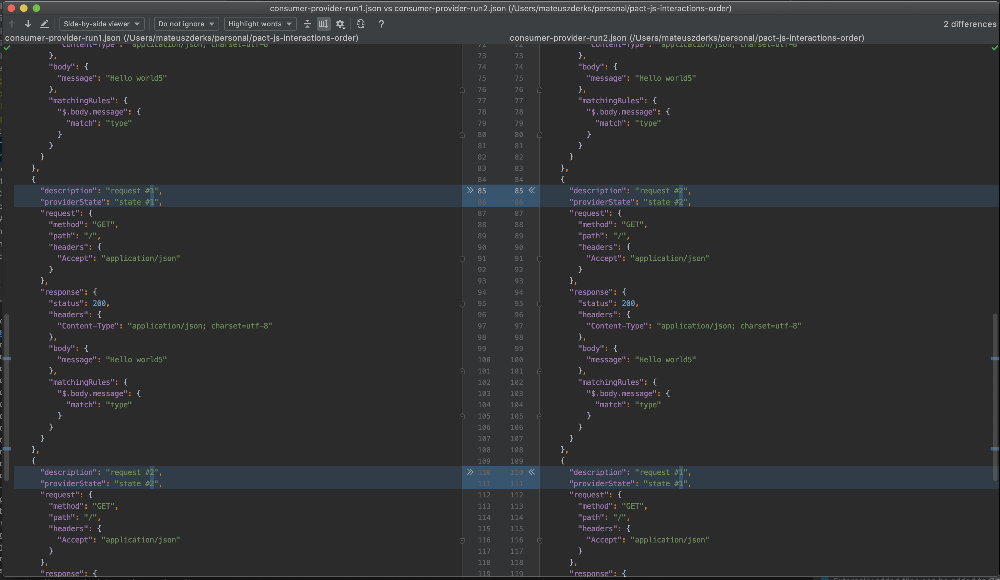

# pact-js-interactions-order

This is an example project using `@pact-foundation/pact` and `pact-jest` to run consumer pact tests.

## Problem

When a project uses multiple files with pact interactions and runs them with `jest` the content of the contract file
may change even the consumer tests did not. It's caused by undeterministic order of loading test files.

To spread interactions across files we need to use:
```
pactfileWriteMode: 'merge'
```
and then each spec file adds it's interactions to the contract file in the same order that spec files are executed.

## Example

Compare `./consumer-provider.run1.json` with `./consumer-provider.run2.json` to see what changes inside the contract file.



## Steps to reproduce the problem

1. Install all dependencies
```bash
yarn
```

2. Run the consumer pact tests
```bash
yarn test
```

3. Run the consumer pact test again and again. See that the `pact/pacts/consumer-provider.json` includes the same
interactions but in undeterministic order.
